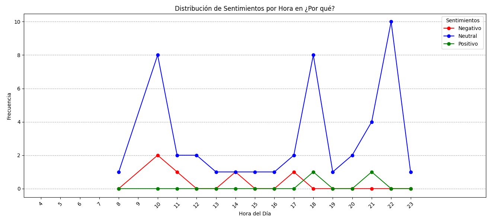
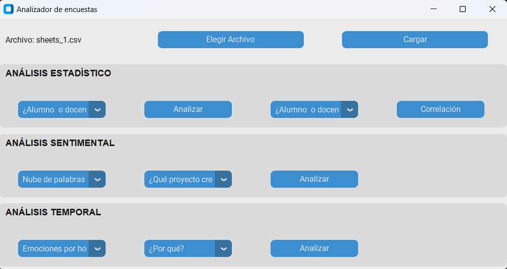
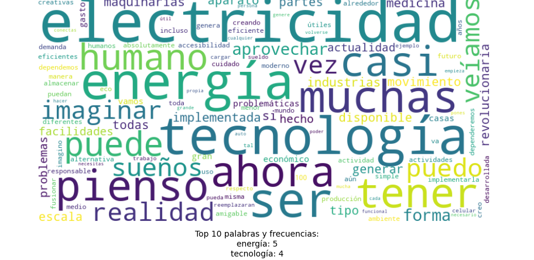
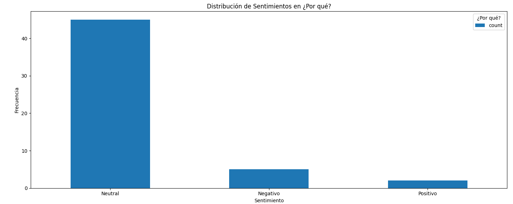
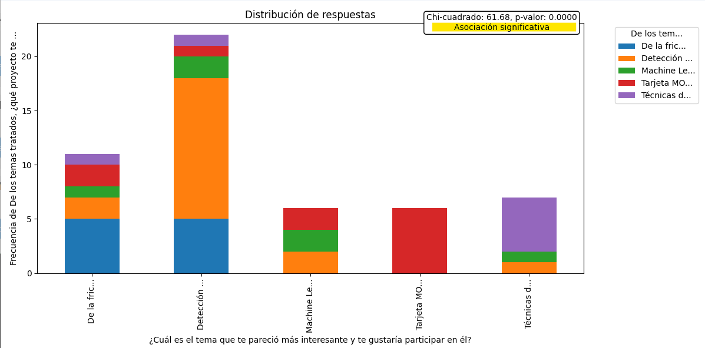

# **SentimentSurveyor**
This Python application leverages CustomTkinter to offer a ***comprehensive analysis of survey data collected in CSV format***, typically from platforms like Google Forms. It's designed to extract meaningful insights through **three core analysis types**: ***Statistical, Sentiment, and Temporal Analysis***. Whether you're looking to visualize closed question responses, gauge sentiment from open-ended answers, or track response patterns over time, this tool provides the necessary functionality to make informed decisions.

### **Emotion tracking**

## Features
- **Statistical Analysis**:
  - Pie charts visualization for closed questions.
  - Correlation analysis between two closed questions.
- **Sentiment Analysis**:
  - *Word cloud* and frequency analysis of the **most important (not used)** words in open-ended responses.
  - *Sentiment detection* in open-ended responses.
- **Temporal Analysis**:
  - Responses distribution by hour and by day.
  - Emotion tracking by hour.

### **Window**

### **Word cloud of most important words**

### **Sentiment detection in open-ended responses**

### **Correlation between two questions**

